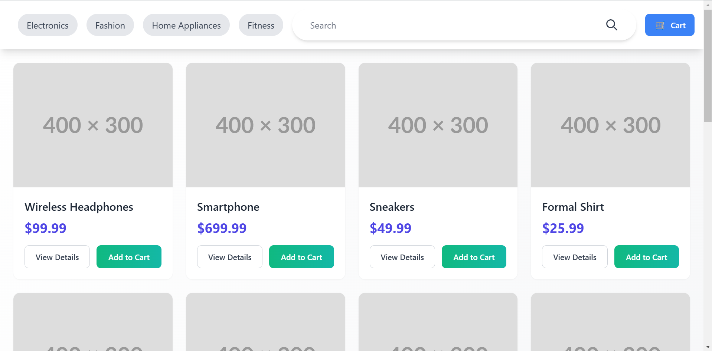
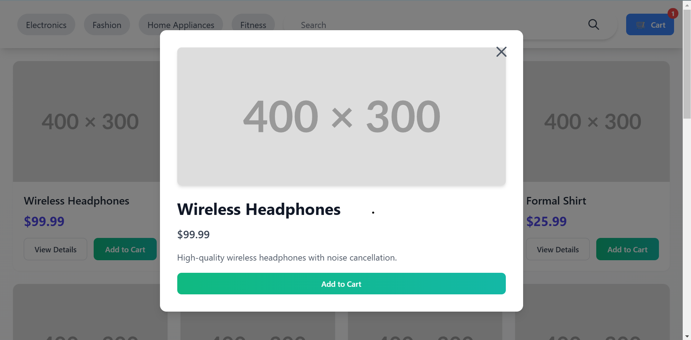

# React Product Catalog

This is a simple single-page application (SPA) built with React that showcases a product catalog. It allows users to search and filter products by category, view detailed product information, and add items to their cart. The app uses a mock API to fetch product data and Tailwind CSS for styling.

## Features

- **Search**: Search products by name.
- **Category Filter**: Filter products by category.
- **Add to Cart**: Add products to your cart and view the total items in the cart.
- **Product Details**: View detailed information about each product.
- **Cart Page**: View and manage items in the cart.
- **Responsive Design**: Fully responsive with Tailwind CSS.
- **Lightweight**: Built using only React and Tailwind CSS.

## Installation

Follow the steps below to run the project locally.

1. **Ensure Node.js is installed**:
   Make sure you have Node.js installed on your system. You can download and install it from [nodejs.org](https://nodejs.org/).

2. **Clone the repository**:

   ```bash
   git clone https://github.com/mdarslan7/react-product-catalog.git
   cd react-product-catalog
   ```
   
3. **Install the dependencies**:
    ```bash
   npm install
   ```
   
4. **Start the application**:
    ```bash
   npm start
   ```
   This will start the app and open it in your default web browser. The app will be running at http://localhost:3000.
   
 ## Libraries and Tools
 - **React**: JavaScript library for building user interfaces.
- **Tailwind CSS**: A utility-first CSS framework for rapid UI development.
- **React Router**: For client-side routing to handle navigation between pages.

## Optional Enhancements Implemented

- **Cart Functionality**: Implemented the ability to add products to the cart and view the cart.
- **Animations**: Added a small animation to the cart icon when there are items in the cart.
- **Sorting**: Products can be filtered by category and searched by name.
- **Cart Page**: Added a cart page to view and manage items in the cart.
- **Footer**: Added a footer with the name of the app.
- **Mock API Integration**: Replaced the static `products.json` data with a mock API for fetching product data.

## Screenshots

Here are some screenshots of the app:
- **Homepage**:
    <br><br>
- **Product Details Page**:
    <br><br>
- **Cart Page**:
   

## Challenges Faced

- **Search and Category Filter Issues**: One of the challenges was making the search and category filter work correctly when the cart functionality was added. Initially, both features were not behaving as expected when interacting with the cart. This issue was resolved by properly managing the state and ensuring the filters only applied to the products displayed.
  
- **Handling State Management**: With multiple states being managed (search, categories, cart), it became challenging to ensure state updates happened in the right order. I had to carefully manage the states in the context to prevent unnecessary re-renders and ensure that data was passed correctly across components.
